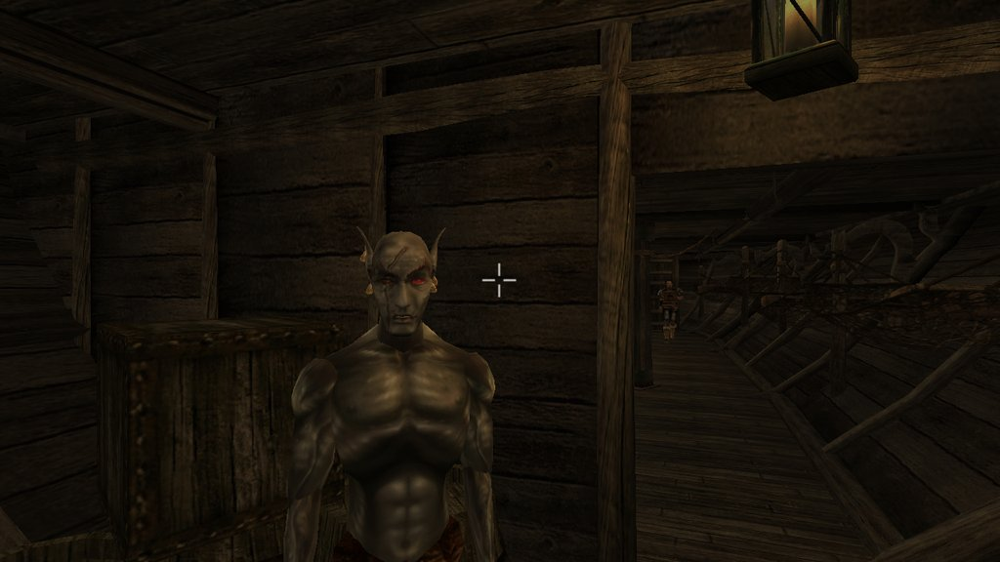

# pi plays Morrowind

A cloud LLM plays The Elder Scrolls III: Morrowind (through [OpenMW](https://openmw.org)) on
macOS, driven by the [pi coding agent](https://www.npmjs.com/package/@earendil-works/pi-coding-agent).



Inspired by [geohot/pi_plays_pokemon](https://github.com/geohot/pi_plays_pokemon), and built
on the same idea: **the model gets no game context beyond the controls and the screenshots.**
The harness gives it no cell names, coordinates, stats, object lists, quest text or
walkthrough hints. It sees the screen, reads what a player would read, and acts through
player-level controls: move, turn, activate what's under the crosshair, keys and clicks.
Besides the screenshots it gets only the system prompt (controls and how the harness
behaves), your goal prompt, and a one-line step summary per action, such as
`step 12: turn degrees=-30, screen change 18.4%`. Whatever the model already knows about
Morrowind from training is still its own.
The first goal is the classic opening: finish character creation on the prison ship and step
off the boat at Seyda Neen.

## How it works

- `.pi/extensions/morrowind.ts` is a pi extension with three tools: `look` (screenshot),
  `act` (move, turn, activate, click, type, key, wait…) and `report` (end the run).
  It replaces pi's system prompt with `.pi/SYSTEM.md` (controls only) and turns off all
  other tools and context files, so nothing about the game leaks in.
- `game.py` is a sidecar that launches OpenMW, takes window screenshots, sends macOS
  keyboard/mouse events, logs each run, and serves a small web UI.
- `mod/` is an OpenMW Lua mod that runs in-world actions (move, turn…) frame by frame and
  reports back to the sidecar. It also records game state, for the run logs and the web UI
  only; the model never sees it.

You watch the model's reasoning and actions in the pi terminal. The web UI shows the live
screen and a step table.

## Setup (macOS, Apple Silicon)

1. **OpenMW.** Download the macOS (Apple Silicon) build from
   [openmw.org/downloads](https://openmw.org/downloads/) and move `OpenMW.app` to
   `/Applications`. Tested with 0.52.0.
2. **Morrowind game files.** You need the original data from the Steam version (Game of the
   Year edition): the `Data Files` folder with `Morrowind.esm`, `Tribunal.esm`,
   `Bloodmoon.esm` and the `.bsa` archives. Open `OpenMW.app` once and let its installation
   wizard import that folder. The harness layers its own config on top of the one the wizard
   writes (`~/Library/Preferences/openmw/openmw.cfg`) and never modifies your settings or
   saves.
3. **Python sidecar.**
   ```bash
   brew install python@3.12 luajit   # luajit is only used to syntax-check the mod
   python3.12 -m venv .venv
   .venv/bin/pip install -r requirements.txt
   ```
4. **pi.**
   ```bash
   npm i -g @earendil-works/pi-coding-agent
   pi   # then /login (e.g. ChatGPT or Claude subscription) and pick a model
   ```
5. **Permissions.** Give the terminal you run pi from **Screen Recording** and
   **Accessibility** access (System Settings → Privacy & Security). They are needed for
   screenshots and synthesized input.

## Play

```bash
PI_FRESH=1 pi -a --model openai/gpt-5.5 "Leave the prison ship."
open http://localhost:8342   # live screen + step table
```

- `-a` lets pi load the project's extension.
- `PI_FRESH=1` starts a new game; without it, pi attaches to a running one.
- The extension starts the sidecar on the first tool call, and the sidecar starts the game.

Each run is saved to `runs/<run-name>/`: screenshots (`frames/`), `actions.jsonl` and
`result.json` (the model's verdict plus harness milestones, e.g. `left the ship`). Stop
everything with:

```bash
pkill -f "openmw --config"; pkill -f 'game\.py'
```

The game window only takes focus for clicks, typing and key presses, then hands it back, so you can keep
using the Mac. Leave the OpenMW window visible and don't move the mouse over it, because
with the cursor ungrabbed that turns the camera.

Options: `PI_PAUSE=1` freezes the world between actions while the model thinks.
`RUN_NAME=…` names the run.

## Notes

- Morrowind is copyrighted. This repo contains no game assets; bring your own copy.
- Developer notes (architecture, dev loop, known issues) are in `AGENTS.md`.
